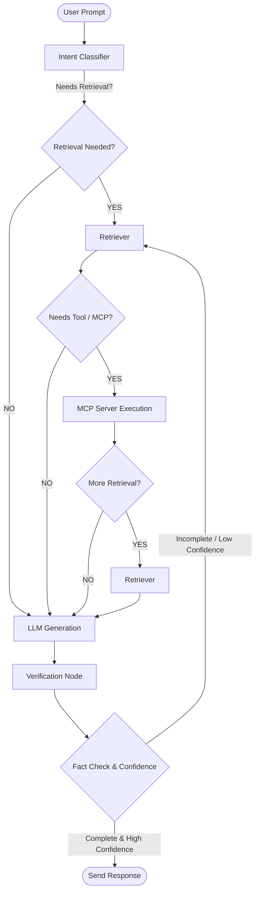

# RepoVerse AI - Implementation Plan (Updated)

RepoVerse AI is a space-themed repository visualization and RAG-based AI assistant. It provides developers with an immersive, interactive representation of their codebases while grounding chat queries in repository structure and code symbols.

---

## Technical Stack & Architecture

### Backend: FastAPI
*   **Routing & APIs**: Standard REST endpoints for codebase indexing, file loading, and folder trees.
*   **WebSockets**: Real-time websocket endpoints for streaming responses, live agent state notifications, and progress visualization.
*   **Server Core**: Modular Python server designed for low latency and high scalability.

### Frontend: React + TypeScript + Vite + TailwindCSS
*   **Layout**: Rich multi-pane IDE-like layout (Galaxy Explorer | AI Chat | Repository Overview & Source Preview) with a Top Navbar.
*   **Animations**: Framer Motion for sleek transitions, fade-ins, and glowing orbital animations.
*   **Visualizations**: React Flow to visualize the codebase architecture and LangGraph decision-making paths.

---

## Space Theme Mapping (Expanded)
*   **🌌 Universe**: All loaded/indexed repositories.
*   **🌀 Galaxy**: The active Git repository being analyzed.
*   **✨ Constellation**: Feature Groups / Architectural Clusters (e.g. `Authentication`, `Database`, `APIs`).
*   **⭐ Star**: Folders/directories within the repository.
*   **🪐 Planet**: Individual files.
*   **🌙 Moon**: Functions or classes within files.

---

## AI & Retrieval Models

| Component | Choice | Why |
| :--- | :--- | :--- |
| **Embeddings** | `BAAI/bge-small-en-v1.5` | Top-tier retrieval quality, free, lightweight, strong code search performance. |
| **Vector DB** | `ChromaDB` | Embedded, locally stored vector store with standard integration. |
| **Primary LLM** | Groq `llama-3.3-70b-versatile` | Ultra-fast inference speed with a generous free API tier. |
| **Code LLM** | Qwen2.5-Coder (Hugging Face / Ollama) | Specialized LLM for codebase understanding, refactoring, and AST-grounded queries. |
| **Fallback LLM** | Ollama `qwen2.5` / `llama3` / `deepseek-r1` | Provides fully offline execution support. |

---

## Parsing & RAG Pipeline

### 1. Ingestion Workflow
```
Repository ➔ Parser ➔ Language Detection ➔ AST Parsing ➔ Chunk Builder ➔ Metadata ➔ Embeddings ➔ ChromaDB
```

*   **AST-Aware Parser**: Identifies class definitions, functions, imports, and exports for Python and JavaScript/TypeScript.
*   **Chunk Schema**:
    ```json
    {
      "path": "relative/path/to/file.py",
      "language": "python",
      "class": "ClassName",
      "function": "method_name",
      "imports": ["os", "fastapi"],
      "exports": ["MyRouter"],
      "summary": "Handles JWT verification and payload parsing",
      "chunk_type": "function"
    }
    ```

### 2. Retrieval Strategy
*   **Hybrid Search**: Executes Vector Search + BM25 lexical search.
*   **Filters**: Applies metadata filters based on AST symbols (e.g., matching functions, imports, or files).
*   **Reranking**: Integrates a lightweight Cross-Encoder reranker to sort the top-k documents prior to context injection.

---

## Agentic Orchestration (LangGraph)

### Graph Workflow
LangChain is used to interface with the retrievers and splitters, while LangGraph manages the state machine, decision routing, and loop executions.



### Node Explanations
1.  **Intent Classifier**: Analyzes query to determine if code/doc retrieval or general conversation is required.
2.  **Retriever Node**: Runs the hybrid Vector + BM25 pipeline to pull candidate code snippets.
3.  **MCP Node**: Executes external tool invocations:
    *   *Filesystem*: Read specific source lines, list folders.
    *   *GitHub*: Read pull requests or track file versions.
    *   *Browser*: Fetch API documentation.
    *   *Git*: Run logs or diffs (e.g., "What changed yesterday?").
    *   *Terminal*: Run local test suites (`pytest`, `npm test`) or build checks.
4.  **Generation Node**: Builds response grounding it strictly in facts from retrieved chunks.
5.  **Verification Node (Fact Checker)**:
    *   Compares the generated answer against the source contexts.
    *   Assigns a confidence score.
    *   Verifies if all necessary sources are present. If incomplete, loops back to **Retriever** with refined sub-queries.

---

## Streamlit vs. React Layout

The application will feature an immersive, dark-themed, 3-column layout resembling a high-tech IDE space station:

```
────────────────────────────────────────────────────────────────────────────────
                                  TOP NAVBAR
  🪐 Universe: All Repos  |  🌀 Active Galaxy: SUMMERTRAININGPROJECT  |  ⚙️ Settings
────────────────────────────────────────────────────────────────────────────────
   GALAXY EXPLORER       │          AI CHAT          │    SOURCE PREVIEW
                         │                           │
   🌌 Constellations     │   [Agent Status: Idle]    │   [Planet: auth.py]
    ├─ ⚡ Auth (Group)   │                           │   ```python
    │  ├─ login.py       │   User: Show me how JWT   │   def verify_token(..):
    │  └─ jwt.py         │   is validated.           │       # Auth flow
    ├─ 📦 Database       │                           │   ```
    │  └─ connection.py  │   AI: Analyzing jwt.py... │   
                         │   Based on [jwt.py](line 5): │   ────────────────────────────
   ⭐ Star: /src/api     │   It decodes standard JWT │    REPOSITORY SUMMARY
   🪐 Planet: routes.py  │   tokens using HS256.     │    Auto-generated overview of
   🌙 Moon: post_route() │                           │    tech stack & entry points.
────────────────────────────────────────────────────────────────────────────────
```

### Missing Feature: Automated Repository Summarization
Upon initial indexing of a Galaxy (repository), the system will automatically trigger a background agent node to compile a **Repository Summary**:
*   Project Technical Stack
*   System Architecture Design
*   Entry Points & Dependencies
*   High-level Feature Groups (Constellations)
This summary is presented in the sidebar/preview workspace before the user asks any questions.

---

## Verification Plan

### Automated Verification
*   **AST Parser Unit Tests**: Feed synthetic Python & JS files, assert correct mapping of files (Planets) and classes/methods (Moons).
*   **RAG Retrieval Tests**: Assert retrieval yields correct document context for keyword and semantic-based queries.
*   **LangGraph Decision-Tree Tests**: Simulate state graph walks and check if the fact-checking node correctly loops back on hallucinated text.

### Manual Verification
*   Verify live WebSocket logs showing LLM chunk streaming and agent routing states in real-time.
*   Inspect CSS grid responsiveness across multiple window widths.
*   Run the project build script and verify complete bundle output.
